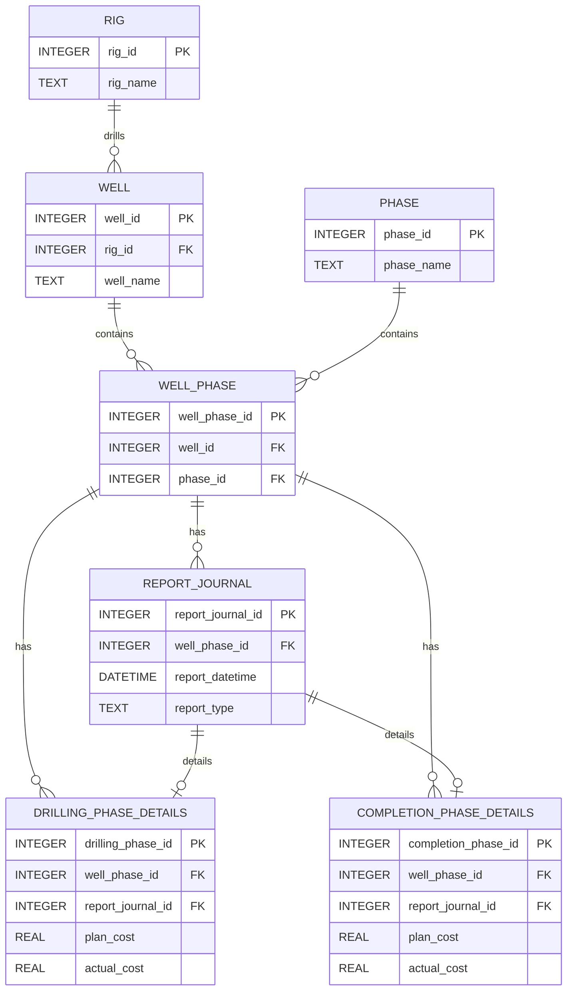

# SQL Mastery: From Data Models to Queries
## SQL Training Workbook & Lab Guide
**Trainer:** Adlina Ahmad & Faiz Samsudin  
**Date:** June 11, 2026 (Thursday)  
**Venue:** AEM Office – Meeting Room 1  

---

## Course Objective & Welcome
Welcome to the SQL Mastery course. This training guide is designed to take you from a basic understanding of SQL querying to designing clean relational tables, writing complex analytical reports, and identifying critical data quality issues like duplicate entries and orphan records.

Our case study is centered on a **Drilling & Operations database** (`drilling_course.db`). You will work with tables representing drilling rigs, wells, drilling/completion phases, operational reports, and daily cost logs.

---

## SQL Tools & Environment Setup

To write and execute your SQL queries during the course, you have two options:

1. **Interactive Database Explorer (Recommended for Quick Reference):**
   * Start the local server to enable the training portal:
     * **Windows:** Run [start_portal.bat](../start_portal.bat) (e.g., by double-clicking it).
     * **macOS/Linux:** Open a terminal in the `portal/` subdirectory of the project and run `python3 -m http.server 8000`.
   * Open the training portal at [http://localhost:8000/index.html](http://localhost:8000/index.html) in your web browser.
   * Click the **Database Explorer** tab on the sidebar to instantly search, inspect, and page through the active tables side-by-side with your exercises.
2. **Local SQL Client (For Writing & Running Queries):**
   * Download and install **DBeaver** or **DB Browser for SQLite** (both are free, cross-platform, and open-source).
   * Open the tool and create a new connection, selecting **SQLite** as the database type.
   * Browse to and select the `drilling_course.db` file in the `database/` subdirectory of this workspace.
   * You can open a new SQL editor/console in your client to write, run, and experiment with your query solutions.

---

## 1. Database Schema & ERD

To query the database effectively, we must first understand its layout. Below is the Entity-Relationship Diagram (ERD) showing how the entities are structured and related.

### ERD Diagram (Crow's Foot Notation)



### Table Metadata & Reference
1. **`RIG`**: Holds rig information.
   * `rig_id` (PK): Unique identifier for each drilling rig.
   * `rig_name`: Name of the rig (e.g., *Ocean Valor*).
2. **`WELL`**: Represents oil/gas wells.
   * `well_id` (PK): Unique identifier.
   * `rig_id` (FK): The rig currently drilling or associated with this well.
   * `well_name`: Name of the well (e.g., *Alpha-1*).
3. **`PHASE`**: Static lookup for phase names.
   * `phase_id` (PK): Unique identifier.
   * `phase_name`: Phase description (e.g., *Exploration*, *Workover*).
4. **`WELL_PHASE`**: Bridge table forming a many-to-many relationship between `WELL` and `PHASE`.
   * `well_phase_id` (PK): Unique identifier for a well in a specific phase.
   * `well_id` (FK): Links to `WELL`.
   * `phase_id` (FK): Links to `PHASE`.
5. **`REPORT_JOURNAL`**: Daily reporting entries.
   * `report_journal_id` (PK): Auto-incremented identifier.
   * `well_phase_id` (FK): The active well phase the report belongs to.
   * `report_datetime`: Timestamp of report submission.
   * `report_type`: Type of report (*NOOP* and *FWR* for drilling; *NOOC* and *FWC* for completion).
6. **`DRILLING_PHASE_DETAILS`**: Detailed cost metrics for active drilling phases.
   * `drilling_phase_id` (PK): Unique identifier.
   * `well_phase_id` (FK), `report_journal_id` (FK): Link keys.
   * `plan_cost`, `actual_cost`: Estimated vs. real expenses for the day.
7. **`COMPLETION_PHASE_DETAILS`**: Detailed cost metrics for completion phase (Phase ID = 4).
   * Same schema as drilling details, but isolated for completion-specific operational analysis.

---

## Session 1: Data Modelling & SQL Basics
**Time: 9:15 AM – 10:45 AM**

### Key Concepts
* **Primary Key (PK)**: A column (or set of columns) that uniquely identifies a row in a table. It cannot contain NULL values and must be unique.
* **Foreign Key (FK)**: A column that establishes a link between data in two tables. It references the Primary Key of another table, ensuring *Referential Integrity*.
* **Normalization**: The process of organizing data in a database to reduce redundancy and improve data integrity.
  * *1NF*: Eliminate duplicate columns, ensure atomicity of data.
  * *2NF*: Meet 1NF, and ensure all non-key attributes are fully dependent on the primary key.
  * *3NF*: Meet 2NF, and ensure no non-key attribute is transitively dependent on the primary key (no columns depend on other non-key columns).
* **Types of JOINs**:
  * **INNER JOIN** (default `JOIN`): Returns records that have matching values in both tables.
  * **LEFT JOIN**: Returns all records from the left table, and the matched records from the right table. Unmatched rows from the right return `NULL`.
  * **RIGHT JOIN**: Returns all records from the right table, and the matched records from the left table.
  * **FULL OUTER JOIN**: Returns all records when there is a match in either the left or right table.
* **Core SELECT Blocks & Execution Order**:
  ```sql
  SELECT columns               -- [5] Projection
  FROM table_a                 -- [1] Data gathering
  JOIN table_b ON table_a.pk = -- [1] table matching
  WHERE condition              -- [2] Row-level filtering
  GROUP BY group_columns       -- [3] Grouping records
  HAVING aggregate_condition   -- [4] Group-level filtering
  ORDER BY sort_column;        -- [6] Sorting output
  ```

### SQL Query Examples

#### Example 1: Filtering & Sorting (SELECT, WHERE, ORDER BY)
Retrieves well names and assigned rig IDs for wells starting with 'Alpha', sorted alphabetically:
```sql
SELECT well_name, rig_id
FROM WELL
WHERE well_name LIKE 'Alpha%'
ORDER BY well_name ASC;
```
*Query Result:*
<!-- BEGIN_RESULT_S1_E1 -->
| well_name | rig_id |
| :--- | :--- |
| Alpha-1 | 1 |
| Alpha-2 | 1 |
<!-- END_RESULT_S1_E1 -->

#### Example 2: Joining Multiple Tables (SELECT, JOIN & WHERE)
Links reports to well metadata, filtering exclusively for daily progress logs (showing first 5 rows):
```sql
SELECT rj.report_journal_id, w.well_name, rj.report_type
FROM REPORT_JOURNAL rj
JOIN WELL_PHASE wp ON rj.well_phase_id = wp.well_phase_id
JOIN WELL w ON wp.well_id = w.well_id
WHERE rj.report_type = 'NOOP';
```
*Query Result:*
<!-- BEGIN_RESULT_S1_E2 -->
| report_journal_id | well_name | report_type |
| :--- | :--- | :--- |
| 1 | Alpha-1 | NOOP |
| 9 | Alpha-2 | NOOP |
| 13 | Bravo-1 | NOOP |
| 17 | Charlie-1 | NOOP |
| 25 | Delta-X | NOOP |
| *[... and 2 more rows]* | | | |
<!-- END_RESULT_S1_E2 -->

#### Example 3: Group Aggregation & Filters (SELECT, GROUP BY & HAVING)
Calculates total actual cost per well phase, displaying only groups exceeding $200,000:
```sql
SELECT well_phase_id, SUM(actual_cost) AS total_actual_cost
FROM DRILLING_PHASE_DETAILS
GROUP BY well_phase_id
HAVING SUM(actual_cost) > 200000;
```
*Query Result:*
<!-- BEGIN_RESULT_S1_E3 -->
| well_phase_id | total_actual_cost |
| :--- | :--- |
| 9 | $205,707.88 |
| 13 | $259,624.41 |
| 17 | $245,355.77 |
<!-- END_RESULT_S1_E3 -->

### Hands-on Lab 1: SQL Basics
*Goal: Familiarize yourself with basic SELECT, JOIN, WHERE, GROUP BY, and HAVING clauses using the rigs, wells, and phases.*

#### Exercise 1.1: List All Wells and their Associated Rigs (SELECT & JOIN)
Write a query to retrieve the name of each well alongside the name of its assigned rig.
```sql
SELECT w.well_name, r.rig_name
FROM WELL w
JOIN RIG r ON w.rig_id = r.rig_id;
```

#### Exercise 1.2: Filter Cost-Intensive Well Phases (SELECT, JOIN & WHERE)
Write a query that displays the well name, phase name, and the plan cost for drilling details (phases 1, 2, or 3) where the plan cost is greater than $100,000.
```sql
SELECT w.well_name, p.phase_name, dpd.plan_cost
FROM WELL w
JOIN WELL_PHASE wp ON w.well_id = wp.well_id
JOIN PHASE p ON wp.phase_id = p.phase_id
JOIN DRILLING_PHASE_DETAILS dpd ON wp.well_phase_id = dpd.well_phase_id
WHERE dpd.plan_cost > 100000
ORDER BY dpd.plan_cost DESC;
```

#### Exercise 1.3: Count Reports per Well (SELECT, JOIN & GROUP BY)
Write an SQL statement that counts the total number of reports logged in `REPORT_JOURNAL` for each well. Display the well name and the total count, grouped by the well name.
```sql
SELECT w.well_name, COUNT(rj.report_journal_id) as total_reports
FROM WELL w
JOIN WELL_PHASE wp ON w.well_id = wp.well_id
JOIN REPORT_JOURNAL rj ON wp.well_phase_id = rj.well_phase_id
GROUP BY w.well_name
ORDER BY total_reports DESC;
```

#### Exercise 1.4: Find Rigs Drilled More than 1 Well (SELECT, JOIN, GROUP BY & HAVING)
Group the wells by rig name and count them. Only display rigs that have been assigned more than 1 well.
```sql
SELECT r.rig_name, COUNT(w.well_id) as well_count
FROM RIG r
JOIN WELL w ON r.rig_id = w.rig_id
GROUP BY r.rig_name
HAVING well_count > 1
ORDER BY well_count DESC;
```

---

## Session 2: Querying Data Using Relationships (Subqueries & CTEs)
**Time: 11:00 AM – 12:30 PM**

### Key Concepts
* **Subquery (Nested Query)**: A query nested inside another query. Can be used in `SELECT`, `FROM`, or `WHERE` clauses. Subqueries can be:
  * *Scalar*: Returns a single value (one row, one column).
  * *Multi-row*: Returns multiple values in a single column (used with `IN`, `ANY`, `ALL`).
  * *Correlated*: References columns from the outer query and runs once for each outer row.
* **Derived Table**: A subquery nested inside the `FROM` clause of a query, acting as a temporary table scoped to the query. In SQL, derived tables **must** be assigned an alias.
* **Common Table Expression (CTE)**: A temporary result set defined using the `WITH` clause. CTEs improve readability and can be referenced multiple times within a single query.
  ```sql
  WITH RigSummary AS (
      SELECT rig_id, COUNT(well_id) as total_wells
      FROM WELL
      GROUP BY rig_id
  )
  SELECT r.rig_name, s.total_wells
  FROM RIG r
  JOIN RigSummary s ON r.rig_id = s.rig_id;
  ```
* **Materialized View**: A database object that physically stores and caches the result of a query on disk (unlike standard virtual views which run dynamically every time). In SQLite, they can be emulated by creating a physical table from a select statement:
  ```sql
  CREATE TABLE MV_TEMP_SUMMARY AS SELECT ...;
  ```

### SQL Query Examples

#### Example 1: Subqueries (Scalar & Correlated)

##### 1A: Scalar Subquery (SELECT / WHERE)
Retrieves drilling details for phases where the actual cost is higher than the average actual cost across all drilling phases:
```sql
SELECT drilling_phase_id, well_phase_id, actual_cost
FROM DRILLING_PHASE_DETAILS
WHERE actual_cost > (SELECT AVG(actual_cost) FROM DRILLING_PHASE_DETAILS)
ORDER BY actual_cost DESC;
```
*Query Result:*
<!-- BEGIN_RESULT_S2_E1A -->
| drilling_phase_id | well_phase_id | actual_cost |
| :--- | :--- | :--- |
| 12 | 17 | $164,457.56 |
| 4 | 5 | $135,290.51 |
| 9 | 13 | $133,150.16 |
| 10 | 13 | $126,474.25 |
| 13 | 999 | $120,000.00 |
| *[... and 1 more rows]* | | | |
<!-- END_RESULT_S2_E1A -->

##### 1B: Correlated Subquery (WHERE)
Retrieves drilling phase details where the actual cost is greater than the average actual cost for its specific well phase:
```sql
SELECT dpd1.drilling_phase_id, dpd1.well_phase_id, dpd1.actual_cost
FROM DRILLING_PHASE_DETAILS dpd1
WHERE dpd1.actual_cost > (
    SELECT AVG(dpd2.actual_cost) 
    FROM DRILLING_PHASE_DETAILS dpd2 
    WHERE dpd2.well_phase_id = dpd1.well_phase_id
)
ORDER BY dpd1.well_phase_id, dpd1.actual_cost DESC;
```
*Query Result:*
<!-- BEGIN_RESULT_S2_E1B -->
| drilling_phase_id | well_phase_id | actual_cost |
| :--- | :--- | :--- |
| 2 | 1 | $73,023.00 |
| 7 | 9 | $108,099.88 |
| 9 | 13 | $133,150.16 |
| 12 | 17 | $164,457.56 |
<!-- END_RESULT_S2_E1B -->

#### Example 2: Derived Tables (Subquery in the FROM Clause)
Retrieves rig names and their count of assigned wells by joining a derived table subquery (aliased as `s`):
```sql
SELECT r.rig_name, s.total_wells
FROM RIG r
JOIN (
    SELECT rig_id, COUNT(well_id) as total_wells
    FROM WELL
    GROUP BY rig_id
) AS s ON r.rig_id = s.rig_id
ORDER BY s.total_wells DESC;
```
*Query Result:*
<!-- BEGIN_RESULT_S2_E2 -->
| rig_name | total_wells |
| :--- | :--- |
| Ocean Valor | 3 |
| Deepwater Horizon | 3 |
| Deepsea Aberdeen | 1 |
<!-- END_RESULT_S2_E2 -->

#### Example 3: Common Table Expressions (CTEs)

Unions the costs from drilling and completion phases, then summarizes the total actual cost per well, joining rig details:
```sql
WITH CombinedCosts AS (
    SELECT well_phase_id, actual_cost FROM DRILLING_PHASE_DETAILS
    UNION ALL
    SELECT well_phase_id, actual_cost FROM COMPLETION_PHASE_DETAILS
)
SELECT w.well_name, r.rig_name, ROUND(SUM(cc.actual_cost), 2) as total_actual_cost
FROM CombinedCosts cc
JOIN WELL_PHASE wp ON cc.well_phase_id = wp.well_phase_id
JOIN WELL w ON wp.well_id = w.well_id
JOIN RIG r ON w.rig_id = r.rig_id
GROUP BY w.well_name, r.rig_name
ORDER BY total_actual_cost DESC;
```
*Query Result:*
<!-- BEGIN_RESULT_S2_E3 -->
| well_name | rig_name | total_actual_cost |
| :--- | :--- | :--- |
| Delta-X | Deepwater Horizon | $499,394.06 |
| Echo-99 | Deepwater Horizon | $457,541.07 |
| Charlie-1 | Deepwater Horizon | $341,354.61 |
| Alpha-1 | Ocean Valor | $289,394.76 |
| Bravo-1 | Deepsea Aberdeen | $286,094.38 |
| Alpha-2 | Ocean Valor | $135,290.51 |
<!-- END_RESULT_S2_E3 -->

#### Example 4: Materialized View Emulation (Physical Query Cache)

For large datasets, computing aggregations on the fly is slow. We can emulate a materialized view by creating a physical table. Notice that querying this table is near-instantaneous since the calculations are already stored:
```sql
-- Create emulated Materialized View
CREATE TABLE IF NOT EXISTS MV_WELL_COST_SUMMARY AS
SELECT w.well_name, r.rig_name, ROUND(SUM(actual_cost), 2) as total_actual_cost
FROM DRILLING_PHASE_DETAILS dpd
JOIN WELL_PHASE wp ON dpd.well_phase_id = wp.well_phase_id
JOIN WELL w ON wp.well_id = w.well_id
JOIN RIG r ON w.rig_id = r.rig_id
GROUP BY w.well_name, r.rig_name;

-- Query the emulated Materialized View
SELECT * FROM MV_WELL_COST_SUMMARY
ORDER BY total_actual_cost DESC;
```
*Query Result:*
<!-- BEGIN_RESULT_S2_E4 -->
| well_name | rig_name | total_actual_cost |
| :--- | :--- | :--- |
| Delta-X | Deepwater Horizon | $259,624.41 |
| Echo-99 | Deepwater Horizon | $245,355.77 |
| Charlie-1 | Deepwater Horizon | $205,707.88 |
| Alpha-1 | Ocean Valor | $143,830.09 |
| Alpha-2 | Ocean Valor | $135,290.51 |
| Bravo-1 | Deepsea Aberdeen | $63,853.61 |
<!-- END_RESULT_S2_E4 -->

> [!NOTE]
> Since the data is physically stored, a materialized view must be refreshed (dropped and re-created, or updated via triggers) whenever the underlying source tables are modified.

### Hands-on Lab 2: Nested Queries & CTEs
*Goal: Use subqueries and CTEs to write clean, maintainable SQL.*

#### Exercise 2.1: Find Wells without Any Logged Reports
Using `NOT IN` or `NOT EXISTS` in a subquery, find wells that do not have any operational reports.
```sql
SELECT well_name 
FROM WELL 
WHERE well_id NOT IN (
    SELECT DISTINCT wp.well_id 
    FROM WELL_PHASE wp
    JOIN REPORT_JOURNAL rj ON wp.well_phase_id = rj.well_phase_id
);
```
*Query Result:*
<!-- BEGIN_RESULT_EX_2_1 -->
| well_name |
| :--- |
| Ghost-1 |
<!-- END_RESULT_EX_2_1 -->

#### Exercise 2.2: Identify Phase-by-Phase Expenditures (Using CTEs)
Use a CTE to combine drilling and completion costs into a single unioned set, then calculate the total plan vs. actual cost per phase across all wells.
```sql
WITH CombinedCosts AS (
    SELECT well_phase_id, plan_cost, actual_cost FROM DRILLING_PHASE_DETAILS
    UNION ALL
    SELECT well_phase_id, plan_cost, actual_cost FROM COMPLETION_PHASE_DETAILS
)
SELECT p.phase_name, 
       ROUND(SUM(c.plan_cost), 2) as total_plan,
       ROUND(SUM(c.actual_cost), 2) as total_actual,
       ROUND(SUM(c.actual_cost - c.plan_cost), 2) as variance
FROM WELL_PHASE wp
JOIN PHASE p ON wp.phase_id = p.phase_id
JOIN CombinedCosts c ON wp.well_phase_id = c.well_phase_id
GROUP BY p.phase_name
ORDER BY variance DESC;
```

#### Exercise 2.3: Cross Join with a Derived Table
Find all drilling phases where the actual cost is higher than the average actual cost of all drilling phases, by joining a derived table that calculates the average.
```sql
SELECT d.well_phase_id, d.actual_cost, ROUND(avg_t.avg_cost, 2) as avg_cost
FROM DRILLING_PHASE_DETAILS d
CROSS JOIN (
    SELECT AVG(actual_cost) as avg_cost
    FROM DRILLING_PHASE_DETAILS
) avg_t
WHERE d.actual_cost > avg_t.avg_cost;
```

#### Exercise 2.4: Materialized Views Emulation
Emulate a materialized view named `MV_WELL_REPORTS` that summarizes the total number of reports logged per well. Query the new view sorting by the most reports.
```sql
CREATE TABLE IF NOT EXISTS MV_WELL_REPORTS AS
SELECT w.well_name, COUNT(rj.report_journal_id) as total_reports
FROM WELL w
JOIN WELL_PHASE wp ON w.well_id = wp.well_id
JOIN REPORT_JOURNAL rj ON wp.well_phase_id = rj.well_phase_id
GROUP BY w.well_name;

SELECT * FROM MV_WELL_REPORTS ORDER BY total_reports DESC;
```

---

## Session 3: Aggregation & Analytical SQL (Window Functions)
**Time: 1:30 PM – 3:00 PM**

### Key Concepts
* **Window Functions**: Perform calculations across a set of table rows that are related to the current row. Unlike regular aggregation, they do not collapse rows.
* **Syntax**: `FUNCTION() OVER (PARTITION BY partition_col ORDER BY sort_col)`
* **Key Window Functions**:
  * `ROW_NUMBER()`: Assigns a unique sequential integer to rows within a partition, starting at 1.
  * `RANK()`: Assigns a rank. If there are duplicate values, they get the same rank, and the next rank is skipped (e.g., 1, 2, 2, 4).
  * `DENSE_RANK()`: Ranks without gaps in ranking numbers (e.g., 1, 2, 2, 3).
  * `SUM(...) OVER (...)`: Calculates running totals.

### SQL Query Examples

#### Example 1: Sequential Row Numbering (ROW_NUMBER)
Indexes all wells drilled by each rig, starting a new sequence for each individual rig:
```sql
SELECT r.rig_name, w.well_name,
       ROW_NUMBER() OVER (PARTITION BY r.rig_id ORDER BY w.well_name) as well_seq
FROM RIG r
JOIN WELL w ON r.rig_id = w.rig_id
ORDER BY r.rig_name, w.well_name;
```
*Query Result:*
<!-- BEGIN_RESULT_S3_E1 -->
| rig_name | well_name | well_seq |
| :--- | :--- | :--- |
| Deepsea Aberdeen | Bravo-1 | 1 |
| Deepwater Horizon | Charlie-1 | 1 |
| Deepwater Horizon | Delta-X | 2 |
| Deepwater Horizon | Echo-99 | 3 |
| Ocean Valor | Alpha-1 | 1 |
| Ocean Valor | Alpha-2 | 2 |
| Ocean Valor | Ghost-1 | 3 |
<!-- END_RESULT_S3_E1 -->

#### Example 2: Ranking (RANK vs DENSE_RANK)
Ranks wells by their total actual drilling costs. Note how RANK leaves gaps if there are ties, while DENSE_RANK does not:
```sql
WITH WellCosts AS (
    SELECT wp.well_id, SUM(dpd.actual_cost) as total_cost
    FROM WELL_PHASE wp
    JOIN DRILLING_PHASE_DETAILS dpd ON wp.well_phase_id = dpd.well_phase_id
    GROUP BY wp.well_id
)
SELECT w.well_name, ROUND(wc.total_cost, 2) as total_cost,
       RANK() OVER (ORDER BY wc.total_cost DESC) as cost_rank,
       DENSE_RANK() OVER (ORDER BY wc.total_cost DESC) as cost_dense_rank
FROM WellCosts wc
JOIN WELL w ON wc.well_id = w.well_id;
```
*Query Result:*
<!-- BEGIN_RESULT_S3_E2 -->
| well_name | total_cost | cost_rank | cost_dense_rank |
| :--- | :--- | :--- | :--- |
| Delta-X | $259,624.41 | $1.00 | $1.00 |
| Echo-99 | $245,355.77 | $2.00 | $2.00 |
| Charlie-1 | $205,707.88 | $3.00 | $3.00 |
| Alpha-1 | $143,830.09 | $4.00 | $4.00 |
| Alpha-2 | $135,290.51 | $5.00 | $5.00 |
| Bravo-1 | $63,853.61 | $6.00 | $6.00 |
<!-- END_RESULT_S3_E2 -->

#### Example 3: Cumulative Running Totals (SUM OVER)
Calculates the cumulative running total of actual costs for each well over consecutive report dates:
```sql
SELECT w.well_name, rj.report_datetime, dpd.actual_cost,
       ROUND(SUM(dpd.actual_cost) OVER (
           PARTITION BY w.well_id 
           ORDER BY rj.report_datetime
       ), 2) as cumulative_cost
FROM DRILLING_PHASE_DETAILS dpd
JOIN REPORT_JOURNAL rj ON dpd.report_journal_id = rj.report_journal_id
JOIN WELL_PHASE wp ON dpd.well_phase_id = wp.well_phase_id
JOIN WELL w ON wp.well_id = w.well_id
ORDER BY w.well_name, rj.report_datetime;
```
*Query Result:*
<!-- BEGIN_RESULT_S3_E3 -->
| well_name | report_datetime | actual_cost | cumulative_cost |
| :--- | :--- | :--- | :--- |
| Alpha-1 | 2025-04-08 00:00:00 | $70,807.09 | $70,807.09 |
| Alpha-1 | 2025-04-09 00:00:00 | $73,023.00 | $143,830.09 |
| Alpha-2 | 2025-02-07 00:00:00 | NULL | NULL |
| Alpha-2 | 2025-02-08 00:00:00 | $135,290.51 | $135,290.51 |
| Bravo-1 | 2025-02-04 00:00:00 | NULL | NULL |
| *[... and 7 more rows]* | | | | |
<!-- END_RESULT_S3_E3 -->

### Hands-on Lab 3: Window Functions & Rankings
*Goal: Create running balances and filter top rows.*

#### Exercise 3.1: Sequential Report Indexing per Well
Generate a list of reports showing the well name, report datetime, report type, and a running sequence number (`report_seq`) for each report belonging to the same well, ordered by date.
```sql
SELECT w.well_name, rj.report_datetime, rj.report_type,
       ROW_NUMBER() OVER (PARTITION BY w.well_id ORDER BY rj.report_datetime) as report_seq
FROM REPORT_JOURNAL rj
JOIN WELL_PHASE wp ON rj.well_phase_id = wp.well_phase_id
JOIN WELL w ON wp.well_id = w.well_id
ORDER BY w.well_name, rj.report_datetime;
```

#### Exercise 3.2: Cumulative Cost Tracking per Well Phase
Calculate the running total of actual cost for each report within a well phase, ordered by date.
```sql
SELECT w.well_name, p.phase_name, rj.report_datetime, dpd.actual_cost,
       ROUND(SUM(dpd.actual_cost) OVER (
           PARTITION BY wp.well_phase_id 
           ORDER BY rj.report_datetime
       ), 2) as running_total_cost
FROM DRILLING_PHASE_DETAILS dpd
JOIN REPORT_JOURNAL rj ON dpd.report_journal_id = rj.report_journal_id
JOIN WELL_PHASE wp ON dpd.well_phase_id = wp.well_phase_id
JOIN WELL w ON wp.well_id = w.well_id
JOIN PHASE p ON wp.phase_id = p.phase_id
ORDER BY w.well_name, p.phase_name, rj.report_datetime;
```

---

## Session 4: Data Integrity & Validation
**Time: 3:15 PM – 4:15 PM**

### Key Concepts
* **Duplicates**: Rows with identical parameters that shouldn't coexist. In relational databases, this is often caused by bulk import issues or missing constraints.
* **Orphan Records**: Rows in a child table (e.g., Details) that reference a key that does not exist in the parent table (e.g., Report Journal). Indicates broken referential integrity. We use a **LEFT JOIN** to find these by returning all records on the left, and filtering for `NULL` on the right side.
* **Database Views**: A virtual table based on the result-set of an SQL statement.
  * Syntax: `CREATE VIEW view_name AS SELECT ...`
* **Handling NULL Values**: Using `COALESCE(val, replacement)` to output a fallback value when encountering `NULL`.

### SQL Query Examples

#### Example 1: Identifying Duplicates (GROUP BY & HAVING)
Identifies duplicate records in REPORT_JOURNAL where multiple entries share the exact same well phase, datetime, and report type:
```sql
SELECT well_phase_id, report_datetime, report_type, COUNT(*) as occurrence_count
FROM REPORT_JOURNAL
GROUP BY well_phase_id, report_datetime, report_type
HAVING COUNT(*) > 1;
```
*Query Result:*
<!-- BEGIN_RESULT_S4_E1 -->
| well_phase_id | report_datetime | report_type | occurrence_count |
| :--- | :--- | :--- | :--- |
| 1 | 2025-04-08 00:00:00 | NOOP | 2 |
| 1 | 2025-04-09 00:00:00 | FWR | 2 |
| 2 | 2025-03-19 00:00:00 | NOOC | 2 |
<!-- END_RESULT_S4_E1 -->

#### Example 2: Finding Orphan Records (LEFT JOIN & IS NULL)
Queries DRILLING_PHASE_DETAILS to locate entries referencing a report_journal_id that does not exist in the main parent table (REPORT_JOURNAL):
```sql
SELECT dpd.drilling_phase_id, dpd.well_phase_id, dpd.report_journal_id, dpd.actual_cost
FROM DRILLING_PHASE_DETAILS dpd
LEFT JOIN REPORT_JOURNAL rj ON dpd.report_journal_id = rj.report_journal_id
WHERE rj.report_journal_id IS NULL;
```
*Query Result:*
<!-- BEGIN_RESULT_S4_E2 -->
| drilling_phase_id | well_phase_id | report_journal_id | actual_cost |
| :--- | :--- | :--- | :--- |
| 13 | 999 | 9999 | $120,000.00 |
<!-- END_RESULT_S4_E2 -->

#### Example 3: Handling NULLs (COALESCE)
Retrieves drilling costs, displaying resolved costs where missing actual costs default to the plan cost value:
```sql
SELECT drilling_phase_id, well_phase_id, plan_cost, actual_cost,
       COALESCE(actual_cost, plan_cost) as resolved_cost
FROM DRILLING_PHASE_DETAILS
WHERE actual_cost IS NULL
LIMIT 5;
```
*Query Result:*
<!-- BEGIN_RESULT_S4_E3 -->
| drilling_phase_id | well_phase_id | plan_cost | actual_cost | resolved_cost |
| :--- | :--- | :--- | :--- | :--- |
| 3 | 5 | $148,522.15 | NULL | $148,522.15 |
| 5 | 7 | $120,182.03 | NULL | $120,182.03 |
<!-- END_RESULT_S4_E3 -->

### Hands-on Lab 4: Data Auditing
*Goal: Audit the database for inconsistencies and clean the outputs.*

#### Exercise 4.1: Identify Duplicates in REPORT_JOURNAL
Find duplicate reports in `REPORT_JOURNAL` that share the exact same `well_phase_id`, `report_datetime`, and `report_type`.
```sql
SELECT well_phase_id, report_datetime, report_type, COUNT(*) as row_count
FROM REPORT_JOURNAL
GROUP BY well_phase_id, report_datetime, report_type
HAVING COUNT(*) > 1;
```

#### Exercise 4.2: Find Orphan Records in Cost Details
Find any cost detail records that refer to a `report_journal_id` not present in the main `REPORT_JOURNAL` table.
```sql
SELECT dpd.drilling_phase_id, dpd.well_phase_id, dpd.report_journal_id, dpd.actual_cost
FROM DRILLING_PHASE_DETAILS dpd
LEFT JOIN REPORT_JOURNAL rj ON dpd.report_journal_id = rj.report_journal_id
WHERE rj.report_journal_id IS NULL;
```

#### Exercise 4.3: Consolidate Costs (Replacing NULLs via View)
Create a view called `V_CLEAN_WELL_COSTS` that consolidates drilling cost records, replacing any missing `actual_cost` values with the matching `plan_cost`.
```sql
CREATE VIEW IF NOT EXISTS V_CLEAN_WELL_COSTS AS
SELECT drilling_phase_id, well_phase_id, plan_cost,
       COALESCE(actual_cost, plan_cost) as finalized_cost
FROM DRILLING_PHASE_DETAILS
WHERE well_phase_id NOT IN (999);
```
To query your view:
```sql
SELECT * FROM V_CLEAN_WELL_COSTS LIMIT 10;
```
